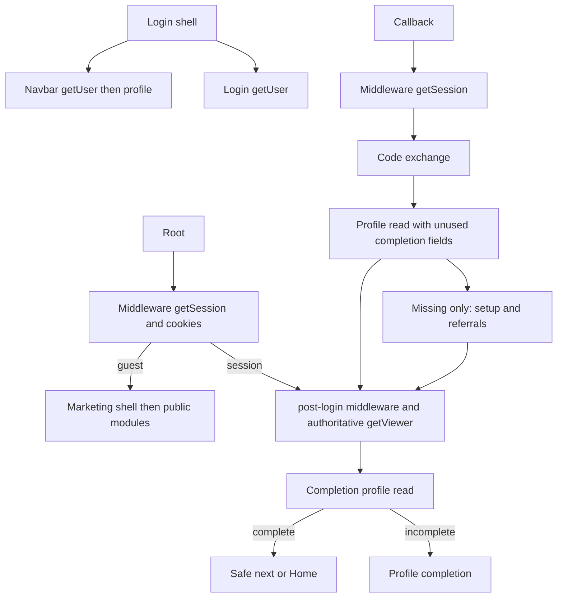
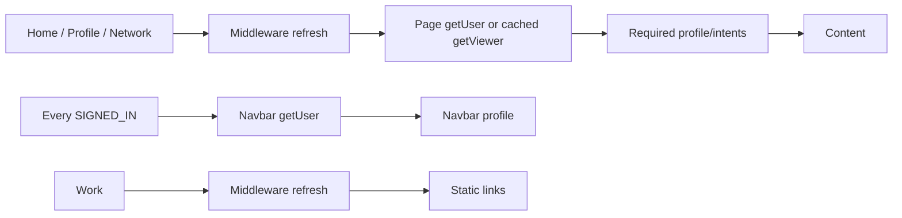
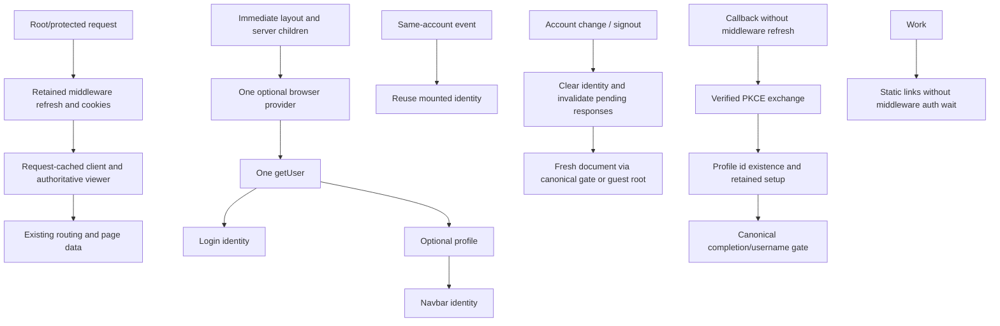

# Makkhan Part 2: auth and navigation review

Verdict: READY TO COMMIT PART 2. Local implementation and synthetic verification; production browser QA remains required.

Baseline: Pass 1 `3683fda`, Pass 2 `18ebf3da35fd4b8a0b73b5d2ec90ab7968ae82c0`, Part 1 `b86c703ebc0112b8837be87f9890bf2e815aee7c`. No commit, push, deployment, production build, database/schema/RLS change, or remote mutation.

## Before audit and read classification

Before editing, actual routes, middleware, layouts, browser initializers, request caching, profile/intent queries, and callback setup were inspected. The new test additionally executes the navbar/login hook sources from the fixed Part 1 Git baseline and reproduces two initial browser getUser calls. These counts are not production timings.

| Operation | Classification | Decision |
|---|---|---|
| Root/protected middleware session refresh and cookies | ROUTING REQUIRED | Retain; cookie session is not authoritative authorization |
| Server getUser / getViewer and API auth | SECURITY REQUIRED | Retain; reuse within a single RSC request |
| Public-profile getViewer calls in actions/content | DUPLICATE, already memoized | Existing React cache already gives one underlying auth read |
| Repeated server-client construction in one render | DUPLICATE initialization | React request-cache client creation |
| Direct getUser on profile/edit/network | SECURITY REQUIRED | Use common getViewer/cache/error policy; current single-page count unchanged |
| Home own-profile and intents | UI REQUIRED, already memoized | Keep one of each per request |
| Account/edit/complete profile and intent data | UI / ROUTING REQUIRED | Retain; forms already receive server-known data |
| Callback profile existence | ROUTING REQUIRED for setup/referrals | Retain id lookup; remove unused completion/role fields |
| Post-login profile completion/username | ROUTING REQUIRED | Retain canonical gate; select only two used fields |
| Navbar initial browser getUser | UI REQUIRED, DEFERRABLE | One mounted provider; no page-content wait |
| Login browser getUser beside navbar | DUPLICATE | Consume provider identity |
| Same-ID SIGNED_IN navbar auth/profile | DUPLICATE | Reuse existing identity; coalesce in-flight events |
| New account / USER_UPDATED auth UI | UI REQUIRED | Reverify; invalidate stale work |
| Navbar profile | UI REQUIRED, DEFERRABLE | Load after verified identity, optional failure |
| Middleware on exact /work | Safely removable | Static public navigation needs no session refresh |
| Middleware on exact /auth/callback | DUPLICATE existing-session read | Callback verifies PKCE and propagates its own cookies |
| Public /u identity / Workplace resolution | UI REQUIRED | Public-first lookup retained; session/RLS fallback only if needed |
| Public relationship / owner state | SECURITY/UI REQUIRED, DEFERRABLE | Existing Suspense and viewer cache retained |
| Explore personalized viewer/profile/intents | SECURITY/UI REQUIRED | Retain; no same-request duplicate found |
| Network API viewer and bulk identities | SECURITY/UI REQUIRED | Independent API still verifies its own request |
| Legacy Navbar / StickyBanner auth reads | Not mounted on audited paths | No app/components imports found; untouched |

No unstable_cache, module-level identity/session store, middleware user-header trust, client-side authorization, or RLS bypass. `/api/*` remains excluded from middleware. Existing getSession is retained for routing/refresh only; downstream getUser/API/RLS remain authoritative.

## Before graphs





## After graphs



The client provider receives server-rendered children as a slot and renders them immediately. It is per mounted document, never a global singleton. Root layout intentionally does not await a server viewer to seed chrome: that would block public/guest rendering. Existing server-known state continues to feed identity/edit/work-mode forms. One cold-document browser verification remains honestly accounted for.

## Flow counts A-M

Evidence: **INFERRED FROM CODE**, with browser duplication, request-scope reuse, middleware decisions and failure paths also **SYNTHETIC** tested. These are logical calls, not network counts: a valid-cookie getSession need not fetch. No timings are inferred. Cold documents include one final chrome initialization; SPA rows retain the layout. Excludes prefetch, retries, StrictMode replay, expiry refresh and concurrent external account events.

M = middleware getSession; S = server getUser; B = browser getUser; E = code exchange. Total = M+S+B+E. P counts own/target identity routing/UI profile reads including chrome; separate domain/candidate queries are detailed below. Redirect hops are application redirects, not user clicks or Google provider pages. Non-admin complete identity assumed except where specified.

| Flow | Before auth | After auth | P before/after | Intents before/after | Hops before/after |
|---|---|---|---|---|---|
| A Guest / | M1 S0 B1 = 2 | same 2 | 0/0 | 0/0 | 0/0 |
| B Guest /login cold | B2 = 2 | B1 = 1 | 0/0 | 0/0 | 0/0 |
| C Guest protected /profile to login | M1 B2 = 3 | M1 B1 = 2 | 0/0 | 0/0 | 1/1 |
| D Authenticated / to Home | M3 S2 B1 = 6 | same 6 | 3/3 | 1/1 | 2/2 |
| E Authenticated /home cold | M1 S1 B1 = 3 | same 3 | 2/2 | 1/1 | 0/0 |
| F Home to Profile SPA | M1 S1 = 2 | same 2 | 1/1 | 0/0 | 0/0 |
| G Profile to Home SPA | M1 S1 = 2 | same 2 | 1/1 | 1/1 | 0/0 |
| H Home to navbar Network (/explore) SPA | M1 S1 = 2 | same 2 | 1/1 personalized | 1/1 personalized | 0/0 |
| H2 Home to connections /network SPA | M1 S2 = 3 including API | same 3 | 0/0 own identity | 0/0 | 0/0 |
| I Home to Work SPA | M1 = 1 | 0 | 0/0 | 0/0 | 0/0 |
| J Google callback to gate to Home | M3 S2 B1 E1 = 7 | M2 S2 B1 E1 = 6 | 4/4 | 1/1 | 2/2 |
| K New Google callback to gate to completion | M3 S2 B1 E1 = 7 | M2 S2 B1 E1 = 6 | 4/4 | 1/1 | 2/2 |
| L A to switch-login to Google B to Home | J + login B1 = 8 | J + login B0 = 6 | 4/4 | 1/1 | 2/2 |
| M Logout to guest / | signOut1 + M1 B1 = 3 | same 3 | 0/0 | 0/0 | 0/0; one document replacement |
| Authenticated /login cold | B2 | B1 | 1/1 | 0/0 | 0/0 |
| SPA to login with mounted chrome | B1 | B0 | 0/0 additional | 0/0 | 0/0 |
| /profile/edit cold complete | M1 S1 B1 = 3 | same 3 | 2/2 | 1/1 | 0/0 |
| /profile/complete cold incomplete | M1 S1 B1 = 3 | same 3 | 2/2 | 1/1 | 0/0 |
| Professional /u/name cold | M0 S1 B1 = 2 | same 2 | target1 + chrome0/1 unchanged | 1/1 | 0/0 |
| Same-ID SIGNED_IN mounted | B1 + profile1 per event | B0 + profile0 | 1/0 | 0/0 | 0/0 |

J/K exclude the initial login document (add B if cold). L starts from mounted Account A; the OAuth callback returns a new document. External cross-tab account changes deliberately invalidate the document for correctness. USER_UPDATED still refreshes identity.

Server getViewer call sites: post-login1, Home1, profile0->1, edit0->1, complete1, network0->1; public Professional normal2 (actions/content), fallback3 (resolution/actions/content), all one underlying getUser per RSC request. Explore retains one direct getUser. Server getSession outside middleware: zero in these pages. Explicit client getSession: zero. Hydration auth work is B; profile forms/work modes/Network have no independent auth initializer. Profile-feed API requests retain their separate server verification.

Additional queries, unchanged:

- Guest root public modules: two profiles queries (community count, featured professionals) plus profile join in gigs. These stream after shell; no own-profile/intent/social-feed load for guest root.
- Home: one candidate-profile query and one candidate-intent query beyond own-profile/intent. Up to three populated serializers query author profiles and mentions; primary reply previews can query commenter identities. Content determines these counts, so no false constant total is claimed.
- Explore: one candidate-profile query plus optional own-profile/intent for personalized all-tab browse. Search/non-all tabs skip personalization. Follow lookups retained.
- Network API: zero or one bulk other-profile query based on connection IDs.
- Public Professional: one anonymous target-profile lookup; second session/RLS lookup only after absent profile AND absent Workplace AND verified viewer. Public intent/membership detail still precedes the header; viewer relationships/counts/work/feed use existing separate Suspense boundaries.
- Workplace: anonymous professional lookup then organization lookup; cached viewerAccess/getViewer gates owner and relationship controls separately. Section-dependent public people/profile joins unchanged.
- New user with referral cookie: optional referrer-profile query and existing setup/referral writes retained. No live writes were executed by this task.

## Route results and security

Root retains pre-HTML cookie routing; authenticated users pass through authoritative post-login and safe next. No LandingRedirect added. Navbar reconciliation now observes current pathname and user instead of capturing the original pathname forever.

Callback retains PKCE, cookie propagation, admin shortcut, safe next, new-profile ensure with ignoreDuplicates, referrals and explicit Google-avatar choice. Its existence read cannot safely be deleted because it controls setup/referrals. Only unused completion payload was removed: six fields to id. Post-login selection narrows six fields to completion/username; complete identity goes to safe next/Home, incomplete to completion. Required read counts and redirect hops remain unchanged.

Profile/edit/network now use getViewer, including bounded authoritative failures. Edit profile DB error becomes a retryable error instead of false incomplete routing; maybeSingle preserves absent profile -> completion. Complete retains safe next and legacy work-role handling. No new blanket Home/Profile completion gate was introduced; existing route behavior is retained.

Server createClient now uses React cache alongside existing cached getViewer. Seven Home client invocations (viewer, own-profile, own-intents, opportunities, network, activity, completion wrapper) share one client per render. This saves client initialization, not seven auth requests: Home already used one getUser. The cache does not cross requests/users or create a route-handler global auth singleton.

Public Professional/Workplace resolution and owner/Connect/Follow/Message controls remain public-first and independently streamed where already supported. Explore's sole direct getUser/personalization remains unchanged. No pagination or social architecture change.

## Browser identity, switching and failures

One AuthUiProvider owns one optional auth subscription. Login/navbar consume the same state. Same-ID SIGNED_IN, INITIAL_SESSION and TOKEN_REFRESHED do not reread auth/profile; USER_UPDATED revalidates. Initial structure/content does not wait on optional chrome. Profile forms already receive server-known props, so no extra auth initialization was added.

Different identity/signout clears both user and profile immediately and invalidates all older generations. Verified result must match expected ID. Late A auth/profile cannot overwrite B or guest. Outside login, account changes replace the document through canonical post-login with safe current destination; signout replaces to root. On login, sign-in navigation remains owned by explicit OAuth/OTP next/cancel behavior. Successful logout has one provider-owned replacement; failure falls back to root for an authoritative cookie recheck, not a claimed successful logout. Chooser cancellation does not proactively sign out A or merge identities.

Events only trigger invalidation/reverification; no server permission is inferred from browser context or event payload. Live OAuth, cross-tab delivery and browser router-cache behavior remain production QA obligations.

Failure policy:

- Middleware error/timeout: existing finite 503, no-store retry; not silent guest.
- Server viewer operational error: fail closed; missing session alone becomes guest.
- Post-login profile error: retryable error, not completion redirect.
- Profile edit error: retryable error; absent row still redirects to completion.
- Browser optional auth failure: neutral chrome, content continues, no authorization grant.
- Profile failure: verified identity can use fallback account UI, never old-account avatar.
- Network boot now uses boundedFetch and catch/finally, clears loading and reports failure.
- Existing 60-second JSON transport/body and 120-second operation ceilings remain recovery limits, not speed targets. Other mutation workflows were not redesigned.

## Verification and performance evidence

- TypeScript: PASS (`node node_modules/typescript/bin/tsc --noEmit --incremental false`).
- P0 auth: 12 groups PASS: safe next including valid query/hash, external/protocol-relative/backslash/control/encoded/auth-loop rejection, routing, cookies, errors/timeouts, chooser options, optional avatar and mobile source constraints.
- New auth/navigation: 21 groups PASS. Actual baseline two browser reads -> one, same-ID reuse, A->B->A, signout, late auth/profile, coalescing, request isolation, failures, middleware exclusions, PKCE existing/new setup, USER_UPDATED, mismatched ID, actual provider replacement callback, profile-edit error, single-owner logout and Network boot error. Request-scope unit test models React caching with AsyncLocalStorage; real Next HTTP test independently checks render behavior.
- P0 social: PASS. Professional Identity: 9 groups PASS. Pass 1: PASS. Pass 2: PASS. Pass 2 final: 19 PASS / 0 FAIL. Pagination: all 29 cases PASS.
- git diff --check: PASS.
- Browser harness attempted; Chrome DevTools Page.enable timed out. Temporary report: gigway-home-qa-AKJ7BP/report.json. **Normal browser, throttled 4x CPU / 150ms / ~1.6Mbps, mobile visual navigation and secondary auth-ready timings: NOT MEASURED.** No claimed browser speedup.
- Local Next HTTP streaming with mock Supabase: all 11 delayed/failure scenarios PASS. Home has one server getUser, one own-profile and one own-intent query; primary streams independently through the new provider wrapper. Temporary report: gigway-home-qa-NXbSpQ/report.json.
- That one warmed development sample had shell bytes at 2505ms and useful-post bytes at 2760ms. Evidence is **SYNTHETIC local HTTP**, not paint/hydration timing, production, or a before/after benchmark. Harness cleanup hung after reporting success; its task was interrupted after results.

Official [Supabase SSR guidance](https://supabase.com/docs/guides/auth/server-side/creating-a-client?queryGroups=framework&framework=nextjs) and [auth event documentation](https://supabase.com/docs/reference/javascript/auth-onauthstatechange) were consulted. Existing SDK APIs retained; cookie sessions are not elevated to authoritative identity; async auth/DB work runs outside SDK callbacks. Changelog markdown endpoint was unavailable; no SDK/config upgrade was made.

## Remaining bottlenecks / required production QA

Authoritative server auth round trips, two root redirects, callback existence plus post-login completion, cold-document browser auth, Home enrichment and public-profile detail reads remain. Successful saves in EditProfileForm now refresh same-account display identity through AuthUiProvider, without another browser getUser call. Other profile mutation entry points must explicitly use that narrow invalidation if they need immediate chrome updates. No claim that every profile read or navigation auth call was eliminated.

Before release: real returning/new Google users, cancelled chooser, A->B->A and another tab, logout/back navigation, safe query/hash, incomplete/admin routing, expiry/cookie refresh, server/nav profile failures, Professional/Workplace owner/relationship controls. Capture requested desktop/mobile/throttled shell, useful-content and secondary-auth marks. Live cross-account browser behavior and timings were not measured here.

## Exact Part 2 files

1. app/auth/callback/route.ts
2. app/auth/post-login/page.tsx
3. app/layout.tsx
4. app/login/page.tsx
5. app/network/page.tsx
6. app/profile/edit/page.tsx
7. app/profile/page.tsx
8. components/connections/NetworkClient.tsx
9. components/layout/ModernNavbar.tsx
10. components/layout/AuthUiProvider.tsx (new)
11. lib/auth/browser-ui.ts (new)
12. lib/supabase/server.ts
13. middleware.ts
14. scripts/test-p0-auth.cjs
15. scripts/test-auth-navigation.cjs (new)
16. docs/makkhan-performance-part2-auth-navigation-review.md (new)
17. components/profile/EditProfileForm.tsx

Protected .claude/settings.local.json, docs/workplace-phase4-audit.md and supabase/audits/ remain byte-identical to the pre-task snapshot and unstaged. Pagination source unchanged. Both generated workers unchanged. public/sw.js SHA-256: `162B5E156486951569C71F24CA9B8FCAB512A792AB9E799DC988747A67C71DA3`. Custom worker: public/worker-RIgomFyrnZBIlFiS9JYxC.js. No staging, commit, push, production build, database/schema/RLS work, remote mutation, deployment, Part 3 or activation work.


## Final review corrections

### Exact /work exclusion: safe, retained

`app/work/page.tsx` has exactly two direct dependencies: Next Link and four lucide presentation icons. It renders constant text and links to /jobs, /projects, /gigs and /freelancers. It has no server queries, client initializer, viewer/profile/intents reads, saved/private opportunities, recommendation state or privileged action. Those four destinations are links, not components rendered within Work. Next Link prefetch/navigation runs the target's own request and guards; it does not inherit the Work exclusion.

Inherited layout dependencies were also inspected: font/CSS and static metadata, ThemeProvider (next-themes appearance state), AuthUiProvider, ModernNavbar, moment presentation and Footer. Footer and moment UI provide public/static presentation. Optional navbar chrome uses its own verified browser identity and RLS profile query; `/work` does not supply it with private server data. Account/menu links are navigation, not permission grants. Signout uses Supabase's authenticated SDK operation. The external advertising script has no application user-data props. No private account content or authorized mutations are moved into the static Work page.

The exclusion compares `pathname === "/work"`; it is not a prefix exemption. Synthetic middleware tests confirm /work has zero session reads, /work/private still executes middleware session handling, and unauthenticated /jobs/new, /projects/new, /gigs/new and /saved redirect to login. Their pages retain independent getUser checks; new-post pages retain completion checks. The linked browse pages keep their original server auth/RLS behavior. Inspected API guards: jobs/projects/gigs creation verifies getUser, organization posting checks membership, jobs management checks ownership/authorization, saved-items mutations use authenticated user IDs, and applications/proposals verify the user. API exclusion from middleware remains safe only because those endpoint checks remain in place; no endpoint was changed by this review.

Classification: Work body = PUBLIC / STATIC / NO USER DATA. Layout account chrome = OPTIONAL AUTHENTICATED DISPLAY, separately verified. Linked private operations = SECURITY REQUIRED at destination/API. The exact Work middleware exclusion exposes none of the prohibited private/saved/application/recommendation state or privileged operations.

### Root redirect conclusion: retain two hops

Before and final graph are identical:

```mermaid
flowchart LR
  Root[Authenticated /] -->|307, refreshed cookies| Gate[/auth/post-login]
  Gate --> Verify[Authoritative getViewer/getUser]
  Verify --> Identity[One profile completion/username read]
  Identity -->|complete| Home[Safe next or /home]
  Identity -->|incomplete| Complete[/profile/complete]
```

The first redirect is middleware's guest-versus-session routing choice, before marketing HTML; it propagates refreshed cookies. It does not authorize identity from cookie contents. The canonical post-login page performs authoritative session resolution and identity-completion gating; its final redirect selects the destination. Root supplies no next parameter; explicit post-login callers continue to use hardened safeReturnTo. Missing session goes to login, operational auth/profile failure remains an error, and incomplete identity is not sent directly Home.

A direct root-to-Home redirect would bypass identity gating. Copying the gate into middleware would duplicate auth/profile logic or require trusting a new identity handoff. An internal rewrite to the existing gate was evaluated locally: it reused one getUser and one profile read, but Next re-entered middleware and returned HTTP 200 with a streamed redirect rather than a simple final 307. This introduces routing/streaming interaction with root navbar reconciliation; the unavailable browser harness could not prove that it consistently removes a browser hop without redundant client reconciliation. The experiment was removed. No rewrite or duplicated gate remains in the final code. This review does not claim that a safe future one-hop architecture is impossible; it retains the verified route contract within the narrow correction scope.

Redirect hops: 2 before / 2 after for normal complete root -> Home, likewise for incomplete root -> completion. No additional auth/profile checks were introduced. Guest root behavior is unchanged and middleware still stops operational refresh failure with a finite retry response.

### Same-account profile-save freshness: fixed

The issue was reproduced against the pre-correction observer: after initial identity loaded, changing the stored display name/avatar with no auth event left mounted UI unchanged. The final path is:

`PATCH /api/profile succeeds -> EditProfileForm refreshProfile(userId) -> mounted observer profile-only read -> shared navbar state`.

The save endpoint and its auth/ownership checks are unchanged. Failed saves emit no refresh. The context exposes a narrow callback through a provider-owned ref, not a browser global or module-level user store. It reads only full_name, username and avatar_url using the existing verified account. Display refresh introduces **zero additional getUser/getSession calls** and one bounded profile query per successful save. Existing router.refresh behavior and its server checks are unchanged. There is no refresh on each navigation and no logout/login requirement.

A separate profile revision invalidates older profile responses without rerunning auth. Both auth generation and profile generation must still match before publishing. Tests verify a delayed old A profile cannot overwrite newer A name/avatar, account switch immediately clears A, and a late A save notification after B is active performs no query and cannot change B. Refresh failure keeps only the last same-account display; cross-account clear/fail-closed behavior is preserved. If initial auth is still pending, its subsequent profile read uses the saved server data; the callback does not trust form props to establish identity.

### Correction validation and files

Final requested runs: TypeScript PASS; P0 auth 12 groups PASS; auth/navigation 21 groups PASS; Professional Identity 9 groups PASS; Pass 1 PASS; Pass 2 PASS; Pass 2 final 19 PASS / 0 FAIL; pagination 29 scenarios PASS; git diff --check PASS. The root rewrite probe was exploratory and is not evidence for a shipped redirect optimization. The final root flow is covered by restored middleware assertions and canonical gate outcome tests.

Exactly five files have net changes during this final-review correction (the broader Part 2 set above remains uncommitted):

- components/profile/EditProfileForm.tsx
- components/layout/AuthUiProvider.tsx
- lib/auth/browser-ui.ts
- scripts/test-auth-navigation.cjs
- docs/makkhan-performance-part2-auth-navigation-review.md

Middleware and P0 auth test sources are byte-identical to their pre-correction versions. Work and post-login application code are unchanged by this correction. Protected files, workers and pagination source remain unchanged and nothing is staged. Database/schema/RLS and remote state are untouched.

Production/browser QA is still required for real saved-name/avatar paint timing, failed refresh behavior, cross-tab account switching, back navigation and cache clearing, root no-guest-flash behavior, cookie refresh, desktop/mobile and throttled performance. Tests are local function/hook/HTTP fixtures; no live-account behavior or timing is claimed. No production build, commit, push, deployment, Part 3 or activation work.
